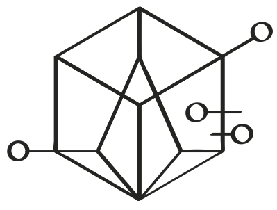

# My Little Plugin

## For Many World Graph Database 

This library bring additional actions to the [MWDB](https://github.com/kevoree-modeling/mwDB) project.

### Actions

Currently addition offered actions are: 

* [Count](doc/Count.md)
* [Get As Var](doc/GetAsVar.md)
* [Get Or Create](doc/GetAsVar.md)
* [If empty then](doc/IfEmptyThen.md)
* [If not empty then](doc/IfNotEmptyThen.md)
* [Inject as Var](doc/InjectAsVar.md)
* [Increment](doc/Increment.md)
* [Keep first result](doc/KeepFirstResult.md)

### How to use it
